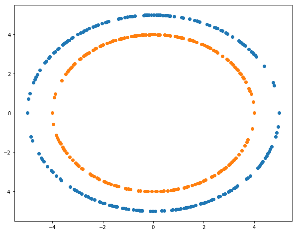
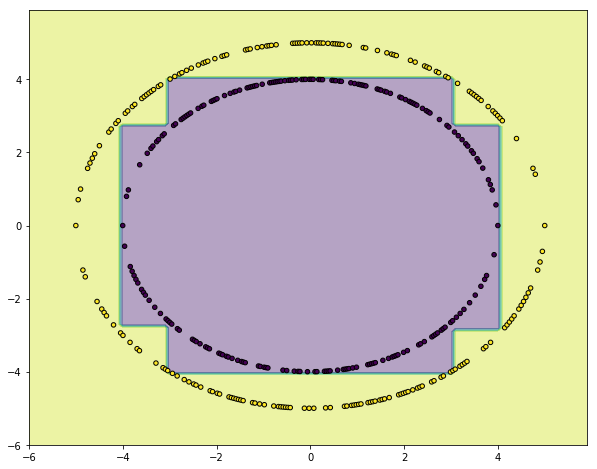

```python
import numpy as np
import matplotlib.pyplot as plt
import random
%matplotlib inline
```


```python
x1 = np.linspace(-5, 5, num=200)
x2 = [np.sqrt(25-i**2) for i in x1]
x2 = [i if random.random() > 0.5 else -1*i for i in x2]
y_1 = np.ones((200,))
x_1 = np.concatenate((np.array(x1).reshape(200,1),
                        np.array(x2).reshape(200,1)), axis=1)


x3 = np.linspace(-4, 4, num=200)
x4 = [np.sqrt(16-i**2) for i in x3]
x4 = [i if random.random() > 0.5 else -1*i for i in x4]
y_0 = np.zeros((200,))
x_0 = np.concatenate((np.array(x3).reshape(200,1),
                        np.array(x4).reshape(200,1)), axis=1)


X = np.vstack((x_1, x_0))
y = np.append(y_1, y_0)
```


```python
fig, ax = plt.subplots(figsize=(10,8))
ax.scatter(x1, x2)
ax.scatter(x3, x4)
```


    <matplotlib.collections.PathCollection at 0x1209acd30>





```python
from sklearn.tree import DecisionTreeClassifier
```


```python
clf = DecisionTreeClassifier()
```


```python
clf.fit(X, y)
```


    DecisionTreeClassifier(class_weight=None, criterion='gini', max_depth=None,
                max_features=None, max_leaf_nodes=None,
                min_impurity_split=1e-07, min_samples_leaf=1,
                min_samples_split=2, min_weight_fraction_leaf=0.0,
                presort=False, random_state=None, splitter='best')


```python
# Plotting decision regions
x_min, x_max = X[:, 0].min() - 1, X[:, 0].max() + 1
y_min, y_max = X[:, 1].min() - 1, X[:, 1].max() + 1
xx, yy = np.meshgrid(np.arange(x_min, x_max, 0.1),
                     np.arange(y_min, y_max, 0.1))

f, axarr = plt.subplots(1, 1, sharex='col', sharey='row', figsize=(10, 8))

Z = clf.predict(np.c_[xx.ravel(), yy.ravel()])
Z = Z.reshape(xx.shape)

axarr.contourf(xx, yy, Z, alpha=0.4)
axarr.scatter(X[:, 0], X[:, 1], c=y,s=20, edgecolor='k')

```


    <matplotlib.collections.PathCollection at 0x1207a6da0>





```python

```
